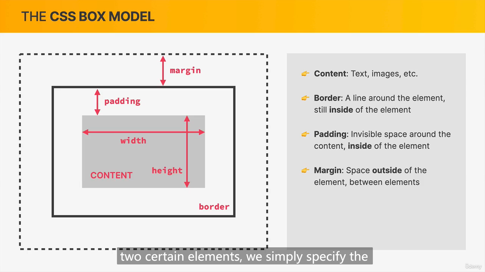
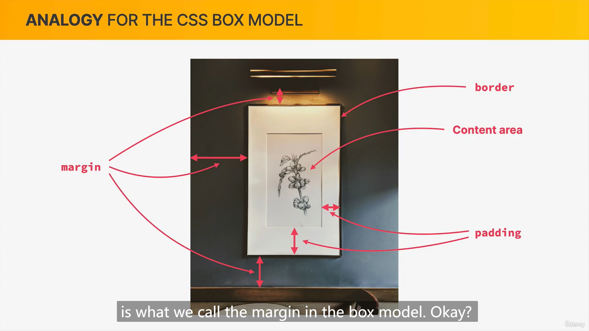
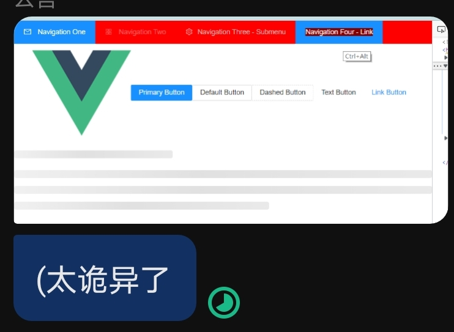

## how to become a master of css

2023-02-03 09:43:45

如何成为 css 大师。嗯...去年六七月份我就吐槽我不会css，那堆东西着实有些杂乱。脑残的东西基本都有“历史原因”，所以，要理解 CSS，就看一下 web 的历史。

web 的 html css js 在最开始都是，...十分孱弱，它们一开始的主要服务目标，就只是展示一个像样的文档出来，对的，是以文档为中心设计的。

- 提到这里我会想提一下，宽与高的的差异...。这也许要从人类现在普遍的阅读习惯开始 bb，基本都是从左到右然后从上到下，所以宽度固定，然后上下的滚动这个设计就变得十分...舒适合理（同时我也在想如果现在的人还像以前，像从竹简时代那种从左到右的阅读文字，那现在的软件设计会不会也是完全不一样的形态...）。

css 最基本的一个东西，是 normal flow，而它则就是针对文档的一个默认布局。布局方面有的只是同行、换行，inline  block 这两个简单的操作。这很...弱，甚至为了搞一个文字环绕图片的效果，都要另外找 float 实现...

- 为什么我要从布局开始 bb ？...可能和画画很像，常人画画都是先打骨架，然后再填充细节。那种上来就直接一块块糊细节还能画的很好的...是神仙。而布局，对画面而言，就是种骨架。当然，如果特别小白完全一无所知的，这里搞不定，先去了解那些小玩具也是可以的。

也许在一开始，或者只需要处理文档的时期，这就够了。

但现在的网页都是什么样的？SPA，除了各种导航栏，还有各种各样的feed，交互，而这些，除了它们自己本身具体的功能、内容，也都需要依赖一个布局系统来将它们合理的安排到屏幕上。

- 而对于非文档类的内容，长与宽的含义就没有那么清晰了，就像游戏，现存的大部分都是带动作交互的动画游戏，在手机上玩甚至基本都要把屏幕横过来...这里就更不可能有什么滚动，3d游戏的视角变换是完全不一样的体验。而这些，与传统的文档 ，css 的 normal flow 也基本没关系了...

### layout

display: block | inline | inline-block | table | etc

好了说点具体点东西吧。block，inline 不想写...就是normal flow。

另外可能会有 Block Formatting Contexts，Inline Formatting Contexts...有没有TFC FFC FGC...感觉就是名字而已，唬人。

#### box model

也许这里，应该从 box model 开始。

但我不想 bb，我丢两个图在这里。




#### table

表格布局，是被扫进历史垃圾堆的...但是，之后的 flex grid 都有它的影子。就只是提一下，想想 excel 的拉长缩小，合并单元格...

multiple column又是谁家的？

#### float

就是说...也是个基本进了垃圾堆的方式

#### flex & grid

是很棒的方式，很好用，但是画面这事吧...感觉咋讲都不太好讲。还有，这里甚至可以说是我开始接触现代 css 并感受到它强大的地方...之后还有动画、响应式...

#### position

对，还有一个 position 在布局里也要提一下，要说的话...相比上面提到的那些，它不适合做布局，但是top、right、bottom、left可以很好的配合JavaScript。嗯，我当初那个瀑布流就是 js + 基本的 position 做的...真是...nc。那时我都不知道还有 DOMRect 这个类型呢...反正ncncncncnc，现在看是完全就是笨蛋，岂止是笨蛋，简直就是笨蛋。

但是之后我那个雪花和 DOM 元素交互的，主要就是玩 JS 的那个脚本，和 position 的配合倒合理的感觉。

[snowfall](https://huamurui.github.io/Snowfall)

position: static | absolute | relative | fixed | sticky

static: 默认值，元素在 normal flow 中，top、right、bottom、left和z-index属性不起作用。

relative：生成相对定位的元素，相对于其正常位置进行定位元素的位置通过 left、right、top、button 属性进行规定.

可以通过 z-index 进行层次分级。
元素元素仍保持其未定位前的形状，原本所占的空间仍将保留。
如果没有定位偏移量，对元素本身没有任何影响。

absolute：生成绝对定位元素。使元素脱离文档流，并相对于其包含块进行定位，包含块可能是文档中的另一个元素或者是初始包含块，元素原先在正常文档流中所占的空间会会被后面元素占据；元素定位后生成一个块级框，而不论原来它在正常流中生成何种类型的框；

绝对定位元素的包含块由离它最近的 'position' 属性'absolute'、'relative' 或者 'fixed' 的祖先元素创建。只要父级元素设置了position并且不是static（默认既是static），那么设定了absolute的子元素即以此为包含块（最近的）；
如果都没有定义，那么就相对于整个文档body定位（注意不是相对于浏览器窗口定位）相对定位一般都是配合绝对定位元素使用。

fixed：生成绝对定位元素，相对于浏览器窗口的定位。

通常配合z-index一起来使用。比如说网页上悬挂的聊天图标或者广告就是用了fixed。

sticky：生成粘性定位元素，可以根据 top 切换实际状态，从relative 到 fixed 之间的。原本需要 js 来实现的，那种 toc ，现在用上它就可以了。

### others

主要就 bb 布局。其他的，日后再谈。

---

## begin-date: 2022-12-16

嗯...就是说，学点css。

就说是，一开始的时候，css对我就只是改个元素大小颜色的小东西，没想过有其他的用处...\
但是看了好多之后，css也好nb哦...现在的css..动画、布局、响应式啥的都整出来了。\
不是说好了all in js的吗...为什么好多骚操作还是放到了html和css里面...嘤嘤嘤

而另一方面，如果要工程化，css写起来还是很操蛋。\
大概是出现了三条路

- 第一个是为了快速开发就出现了boostrap这样的组件库，被称为“组件化”。而针对热门的前端框架还有element-ui，antd等等，这些组件甚至不光是UI，连一部分逻辑都封进去了。缺点是什么？缺点就是没法自己定制，除非这些组件库本身开几个接口让定制，否则难以修改，下面有一个我在好久之前我尝试自己修改时的鬼畜效果。

- 第二个是css预处理器，sass，less这种的，写的还是css，但是优化很多。
- 第三个...大概是从postCss衍生出的tailwind、unocss这些叫做“原子化”的一种，感觉有点怪...它们将css的style的重做了一遍放在class里写，确实是不用写css了，新给出的class可能也的确清晰了些，但这些复杂度又重新转到了html文件里而且不像css还能拆出来。没咋用过。~~看起来有点憨。~~

更新一小下，SCSS 这种的，是要让 css 分离出去并且更强大；而原子化，则是要将css的控制重新插到 html 中；除了原子化还有 css in js 的...不过这个不怎么火。总之，css是就在css里，还是插到 html 里，还是交给 js...
其实都可以，也都有各自好处。

---

## update: 2023-02-01

ps:boostrap 本身也有启动的意思，可能在很多项目都看到过这个名字命名的文件夹或者脚本什么的，不一定就是那个组件库啊哈。。

### 响应式布局

主要依赖于媒体查询，媒体查询的语法是

```css
@media screen and (max-width: 600px) {
  /* ... */
}
```

其实，主要就是依赖屏幕宽度来进行元素排布的设计，因为网页的上下滚动是很常见的...你再长，滚动一下好了，但宽度却不应该这么随意的变化。

500 px 和 1000px

这两个个宽度，基本划分了，手机、平板、电脑的界限。但通常还是会有一个 800px 左右的数值，这个数字是一个细分，为更细致的应对屏幕宽度，也是对电脑浏览器非全屏时的一个应对。

是的...
我知道还有根据字体 size 来做，rem ，em 这些。
还有直接取到屏幕大小的 vw，vh，vmin，vmax ，或者百分比。

但是，px 也不是一个死硬的值，它尝试提供一种稳定的单位，但...很微妙也很有故事。以及，响应式的布局就是主要用 px + 媒体查询做，上面 rem 它们的目的并不在这里。

还有直接使用js获取屏幕大小，然后根据大小去选择渲染完全不同样式的组件与html结构的...这个的适配效果是可以做的最好的...但代价是什么呢？

### css预处理

SCSS 和 LESS 做的最棒的可能就是允许css嵌套，有了作用域，以及变量的加强。

我主要看了一下 SCSS ，用 SCSS 去做网页的主题化...很棒的。

至于 tailwind ... emmm
因为没用过...但是就多主题和响应式布局这个问题，tailwind 会不会变得非常非常臃肿......当然如果直接写好好几个 html 然后由 js 去控制...。确实哦，反正要更加特异化的适配的话，这样也挺爽的。

## update: 2023-02-06

我以为我会了，但是还是被 css 教做人。
md。...不是一回事啊。

## update: 2023-02-22

我感觉我可以说自己会 css 了，但...在这玩意上花时间，真的很慌，都是小玩意，有些能做的很炫酷，但又觉得是无底洞。
国内常用的各种 xxx 管理系统，大部分也没啥美化的需求，这大概也是 tailwind 这些东西起不来的一个原因...
