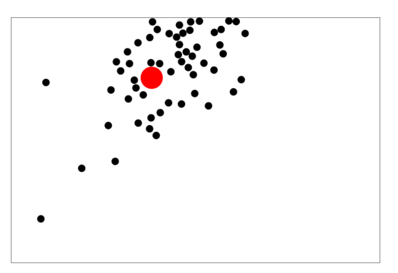
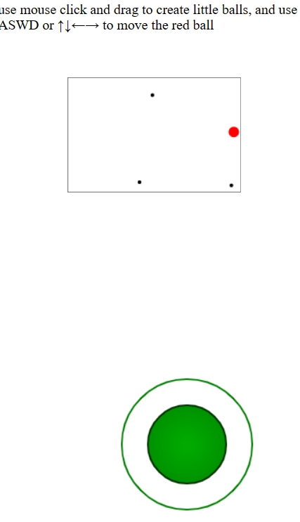

>我在github上翻到了小时候喜欢玩的一个游戏的一部分代码\
……感觉有些，不知道怎么说的感觉。那个游戏在我初中的时候停更，高中的时候关服...\
它所依赖的技术也都过时了\
一门半死不活的语言ActionScript，还有一个被现在大多数浏览器抛弃的平台Adobe Flash\
十年前…\
那时候我还能一玩一整天…\
可是直到它关服我甚至都还不会按F12，也许早点知道的话能看到更多...

所以为什么是碰碰球？因为它简单啊...其实有想过贪吃蛇...但感觉有点麻烦，玩家之间交互麻烦...。主要大概也不是canvas...而是，我想做成一个在浏览器里能玩的，在线的，简单的多人游戏。

要依赖后端去做一个同步。要不要搞“房间”？进入的时候弄个名字选个颜色调调自己球的大小？另一方面，动作更新也是在前端做发给后端，这样才能转发到其他的前端...？传输的时候是不是还要带个token来确认谁是谁...后端到底要存多少东西？...完全没想好。

技术方面，游戏的网络通信，...战网？游戏竟然也有P2P...？

即时的动作、对战类游戏都有它们特化的网络方案，但我不想看...我现在甚至想从“websocket聊天室”这种东西上魔改出一个东西。spring貌似也能做...还有更对口点的socket-io...
但是前端大概...完全和那些框架没关系，顶多两个页面，朝服务器发发请求和数据...

---

嗯...，难搞，那就，哪怕先做成个单人的demo，先想想前端部分。

基本的有，碰撞时改变速度的效果，移动时随时间的加速度，速度上限，加速度固定，边界框框也是个挺重要的东西，是做成相互连接的“瞬移”，还是碰撞体，还是游戏结束的区域，或者交给玩家去选....。球球要有重量吗？这样搞了就要有力，让力成为平衡点..，先不要...。要有大小吗？这只与容易或不容易发生碰撞有关...也许可以加上，反正不难。这些，场地和球球的属性嗯，名字就起Playground和Ball，这部分应该是主要部分\
还有控制输入的方式，键盘，选键位，还有跟随鼠标，再或页面上添一个拖拽的方向盘，直接控制的是加速度，或者说力...还有一个，关于键盘键位，如果是两侧对称的物体，那会有前后控制速度，左右控制方向这样...但是我们是球球，四个键全部搞成速度方向耦合算了，按压着就是有那个方向的加速度，两个不矛盾的同时去按就是给个间位方向，反方向同时按着的话就记成0\
再一个就是，在之后碰撞检测这种事情可能得交给后端或者说服务端..因为要在多端同步。一个挺重要的问题————最少交多少数据可以实现这一部分功能？

碰撞...碰撞的一瞬间发生的应该是速度的变化，包括方向和大小。检测碰撞依赖的是位置。而，想要计算出碰撞之后的变化情况，需要的是碰撞前的速度————方向+大小，也许可以加个重量这个属性但这个先不考虑。

那好吧...我的一个想法就是，平时只发位置，而在检测到碰撞之后，去向前端请求速度信息。————完全没必要，计算还是要全放后端。————只能...一边学不懂的东西一遍处理这些..了吗。用nodejs的后端吧。至少能同一门语言。

算了先做个前端版的。也是为什么我会把这个文章放在这里的原因...吧。

好，整理一下。

- 物理模型，场地和球球
  - Playground
    - 力、加速度
    - 速度上限 & 摩擦力
    - 碰撞检测 & 结果计算
    - 边界
  - Ball
    - 大小
    - 质量
    - 位置
    - 速度

- 输入模式
  - 上下左右
  - 鼠标引导
  - 鼠标，还有移动端的，拖拽的方向盘

先，全在，前端写。突然感觉高中学的物理有点用了..嘿。

对了...我看了的仓库好多都是接近十年前的...原来，真的有好多好多用 IIFE 做模块化的啊...好艰苦...

### 2023-01-07

H5小游戏...的一些游戏引擎。md现在怎么是个游戏就要搞3d那一套...2d就不好玩了吗!?...3d可能是沉浸感...2d还要人..

[Pixi.js](https://github.com/pixijs/pixijs)

[Phaser](https://github.com/photonstorm/phaser)

[CreateJS](https://github.com/createjs)

几年前的好多小仓库...自己写向量对象，自己建物理模型...

如果要找工作也许这不是一个合适的方向...但是好想看...

然后是这个仓库

**[bouncing-balls](https://mtrajk.github.io/bouncing-balls)**

嗯，分析代码。

- 有一个自己实现的向量处理工具，以对象方式呈现-Vector2D
- 然后是ball这个文件里做了Ball这个对象，包括移动、碰撞等物理模型
  - 中学物理.jpg
- 再然后是 bouncing-balls 这个文件里，绑定canvas，动画，事件，添加交互接口...
  - 值得一提的是，这里也有一个，“虚拟画布”的概念。就是，处理物理模型有一个固定的画布大小————宽度单位为 100,长宽比为3:2，就是说，在后台处理运动与碰撞这些事件的时候，处理的数据都是固定的，而渲染出的大小会根据css样式给出的盒子大小进行自动放缩
    - 这很重要，从单机小游戏的各个屏幕适配，到做成前后端分离的多人在线中后台数据的统一处理，这都帮了大忙
    - 这个操作我不是第一次见到...之前在做瀑布流处理那些长方形的时候也有类似操作
    - 但我不确定应该把哪一个叫做虚拟哪一个叫做真实，因为后台处理可以看作一种真实，因为这边决定了各个事件的触发；前端渲染也可以看作一种真实，因为它是实实在在渲染出的效果。
      - 懂了，后台的叫做本质，前台的叫做存在。

这个结构其实和我想的不太一样...

>说起来有点离谱..但我感觉这个游戏(apex)，还有吃鸡，有好多地方和一些小游戏其实很像？\
就比如捡装备像是吃食物，射击游戏里会有各种各样的体现，而贪吃蛇里是自己蛇的身体变长。\
还有个元素是“缩圈”，我就想到了碰碰球那个游戏，把别人从台子上挤下去......

### 2023-01-08

又...因为些无聊事困惑。我想了想，[我都想要](../../../../learn-dialectic/kunhuo/good-feeling.md/#2023-01-08)，对，我都想要，自己学东西做东西，还有，找工作的机会，还有...，我寻思我能行。

就，今天就留给，梳理一些 JavaScript 的东西。主要两个方面，面向对象，还有一个模块化。

#### 面向对象 && 构造函数 && 原型 && 原型链

好久之前学校教java的时候...老师似乎着重提了一下构造函数这一块东西，但当时我真是...不知道在干啥，迷迷糊糊。而我现在看JavaScript 实现面向对象的方式...————从某种意义上讲，定义构造函数即是定义类。这一点我在看用 canvas 做小东西的这两个仓库真是太明显了。。

好了下面我试着整理的清晰一些。

面向对象中最重要的要素无疑就是对象，关于对象，我会想到Hash，Map，Set，这样的有更加具体功能键值对，甚至是 JSON...，键值对可以来回嵌套，其中的“键”通常是字符串，但也可以不是，它是一个标识，类似变量名的标识，而它所标识的东西，所代表的东西，那就多了，可以是另一个字符串、数字，也可以是函数(也许这里应该叫方法)，当然也可以是另一个对象。————仅仅就是键值对(变量与变量值，能指与所指的链接，不只是编程语言..也是自然语言所拥有的，甚至可以说是唯一的也是暴力的功能)，使用这种东西，加上些复杂结构，可以建造出一个十分庞大的世界...

创建对象当然可以像创建变量一样直接使用字面量去创建，缺点是什么？...手动一个个的硬写对象，好累的哦。————而 HTML 这种文档不正是这种方式的一个极佳实现？

但还是太麻烦了，所以就有了，使用构造函数去创建对象。JavaScript 有许多内置的构造函数:

```js
let o = new Object();  // Create an empty object: same as {}.
let a = new Array();   // Create an empty array: same as [].
let d = new Date();    // Create a Date object representing the current time
let r = new Map();   
```

看看它们的形式————在等号/赋值式右边，一个new关键字，然后接上一个构造函数名，带括号的意思就是即时调用。然后就会在左边接收到一个被创建出的对象！

而我们自然也可以自己定义构造函数，在 JavaScript 中，甚至不需要类...直接的一个函数就可以...这也让我们意识到，至少在JavaScript中 并不存在特别去定义构造函数的方法，而是仅当使用 new 时，函数调用会变成 ‘构造函数调用’。
通常，这个函数并不会用 return 去返回什么值，而是通过 this 这个关键字将各种属性绑定到自己，或者应该说，在创建对象时，会自动绑定到将要实例化的那个对象身上。

```js
function Range(from, to) {
    // Store the start and end points (state) of this new range object.
    // These are noninherited properties that are unique to this object.
    this.from = from;
    this.to = to;
}
let range13 = new Range(1,3)
```

到这里我们的重心会放到类这一边，注意，构造函数，或者说类，它们的命名是大写的。这是种规范...
~~但 Captialh还有个意思是资本，怎么说呢，无论好坏，这都是种十分powerful的东西。啊！帕瓦！~~
相比于对象，类是更加抽象的一边，更加接近于“本质”，“造物者”的一边.。

```js
Range.prototype.includes = function(x) { 
  return this.from <= x && x <= this.to; 
}
```

JavaScript 函数对象具有 prototype 属性，而在这里，会有可以添加一系列新东西的机会。prototype 上添和 直接this 添有什么区别？
>this定义的方式，实例化之后是让每一个实例化对象都有一份属于自己的在构造函数中的对象或者函数方法，而prototype定义的方式，实例化之后每个实例化对象共同拥有一份构造函数中的对象或者函数方法。一般而言，用this来定义构造函数的属性较多，用prototype定义构造函数的方法较多。

再另外，在这个属性上，我们可以挂上一堆其他函数，而js中的继承，或者说类似继承的操作，也是利用这里，利用原型链来实现。而在两个小仓库中，用了不知道多少次这样的代码去往构造函数上添东西。

我们不想去一次次手操对象，但我们也并不会想要手操太多类，类所具有的抽象性让我们有机会去巧妙的设计类与类之间的关系进而更加清晰的去描述、实现功能。而这里，就是设计模式。面向对象的所谓三大特性，也应该算在这里。原型链，继承或组合，单例模式...算了这两个小仓库也没用到太多，先打住。

#### IIFE && ES6 modules

之前在看为了应对 var 的怪异的 hosting(突然觉得这个词很形象，变量们被“悬吊”在了代码块之外，乱七八糟的吊在了一个公共空间，可以随意的摘下来用) 特性，去用 IIFE 来获得一个私有空间，IIFE 是可以做模块化的，包括之后let const支持的闭包也是一种小型的模块化，而真正实用，并且权威官方一点的实现，该是 ES6 modules.

也许会有 CommonJS 等等在nodejs之类的社区中的实现..依赖 webpack babel 这样的打包工具来在适配浏览器，但现在既然有了标准，也有了浏览器直接支持的 ES6 modules，...为啥还要整那些呢。不看喵。

```js
<script type="module">

import
export

default，const ...
```

一个类，一个函数，一个代码块，看作一个模块。这挺自然的...完成这个类也许会依赖一些工具函数，这部分实现细节并不是想要暴露的地方，所以要专门的export。

怎么说...引用时直接加上一个type="module"，浏览器就会自动将每个文件视为一个独立的模块。似乎没什么可说的。
而在本地查看时，会因为模块化增强的同源策略，file协议会显示跨域...要搞个LiveServer才能调试。

### 2023-01-09

#### JS函数

嗯...早上还是学JavaScript。\
函数被分为了两个步骤，一个是定义，一个是调用。我曾思考“嵌套函数”和“高阶函数”的区别...而今天...这个问题也更清晰了一些。嵌套，nest，发生在定义时期，而高阶函数，在invoke，调用时才显现。

##### 定义 & 调用

定义函数也许已经习以为常...无非const let ，function关键字，箭头函数。但调用，除了简单的直接调用，会有很多有:
>As functions\
As methods\
As constructors\
Indirectly through their call() and apply() methods\
Implicitly, via JavaScript language features that do not appear like normal function invocations

前三个不多说了，第四个也没什么神秘的..
>方法 call() 和 apply() 可以用来间接地调用函数。两个方法都允许显式指定调用所需的 this 值，也就是说，任何函数可以作为任何对象的方法来调用，哪怕这个函数不是那个对象的方法。两个方法都可以指定调用的实参。\
而与此相关的，还有一个bind()可以将函数绑定到一个对象上。

第五个...看不看都无所谓，都习惯了。

##### 参数

函数参数————...运算符，或arguments

##### 作为namespace的函数...模块化。

对象，类也可以这么做，很自然的，一个函数、类完成一个功能，就把它封成一个模块，一个namespace。

##### 函数的构造器...

是的，函数能作为对象构造器来创建对象，函数本身也属于一种对象，自然函数也能用做函数的构造器

##### 函数式编程

JavaScript并不是门特别函数式的语言，由于面向生产，他的面向对象也是很多的。另外...这两种范式在大部分情况下其实也并不矛盾。

在这里有 map() reduce() ，partial() memoize()。高阶函数。

算了，先收工。

#### 帧同步/状态同步

嗯...也许和网络请求有关系。C# Unity 专门做游戏的话，这里有好多看起来好nb好专业而且不需要开发区思考太多的操作。而对于传统互联网...websocket...发布订阅...pwa...有点...太底层...古朴。重新发布个网页都tmd要专门的去写东西才能让用户拿到最新消息...

RPC Remote Procedure Call

我感觉可以先不考虑这部分了...坑比我想的要深得多。

#### back to balls

其实...看了这些之后...也发现了之前对找到的那个仓库的代码理解有问题，好多也没注意。

- ball.js这个文件里Ball本身只定义了基本的数值属性和一个碰撞检测。之后的move方法，是包了一层 HorizontalBall, VerticalBall 然后各自在其中实现的...在这两个类里，使用了 Ball.call 将各自的方法添到原始的 Ball上。对的，运动规律是在这两个类里实现的，相当于，专门拆了一层，并没有直接硬绑定到基础的球球里面...只是没有单独建文件，我之前觉得放环境里会更好些...因为这是那个场里每个球球都要遵守的。
- bouncing-balls.js里，则是，...竟然真的用 setInterval 做动画...另外这里真的就是一个，具体操作的对象了，也有很多对接，没有太多抽象的部分。
- 添点自己的东西？如果在这个基础上改，我也许会，直接在 bouncing-balls.js 中写东西，创建一个特殊的，受键盘方向控制的球。抽象部分，已有代码要修改的地方，应该也不多...。像上面已经说的，主要问题应该是一个主动增加的加速度和一个速度上限，目前这个体系只有初始化才会有正值出现，加速度变化做的都是衰减。

嗯...其实也又看了看那个 [particles.js](https://github.com/VincentGarreau/particles.js) ，虽然，但是感觉不会那么害怕了...就算几千行一个大文件，慢慢看应该也能看下去。也许我功力还没有大增...但是，至少，感觉上，能开始了。（这个库里竟然...全是用的基础语法，自己写的? prototype只用了一次...new关键字是，主要初始化粒子，还有时间。没有把向量处理摘出来？...好朴素nb的样子)\
再之前，还有注意到一个，叫做 dynamic.js 的用 CoffeeScript 写的一个库...好吧语言还是有点不一样看不太懂先不管这个了。

想到...好多都是刷算法题来掌握编程的，我这个...哈。。挺有意思的。
只是...无名的疲惫...不是因为看书看代码的疲惫...是另一些我还没去做的，不确定与焦虑中的疲惫。
但还是不想干，躺会吧。

#### 数组 & 迭代

嗯，还是不想写代码。
看看，JavaScript的数组。

数组...我觉得数组是种很神奇的东西，不然js也不会为它单开这么多东西，它可以看作一种专门以数字为键的键值对或者说对象。而以数组的思考方式，可以把字符串的每一个字符都添上一个数字键，然后也看作一种数组，并以数组的方式去操作。在之前我们就知道，字符串和对象都能以它们的方式创建出一个世界...那数组肯定也是。

学数据结构的时候..那时候看的是C，链表也是个很重要的东西，栈、队列、二叉树、图什么都可以跟这个有关...但是在js中似乎找不太到它的身影...嗯，js有自动优化，有稀疏数组，链表所做的精打细算利用内存，在这里，并不需要。再一个，链表的很多需要设计实现的功能，js直接用挂在数组上的方法实现了。~~高级语言就是好哇~~不过真要做的话，C用结构体实现链表相关的数据结构，在这些高级语言里，可能就是类、对象。

>插播一个。\
>C语言能否通过结构体实现面向对象编程？

1. 数组创建。\
数组的字面量创建在js中可能算最简单的用法了，...展开运算符也是一个很经典的语法糖，做那些简单操作都很方便。但..很多时候不够用。\
但是，有一个很操蛋的是...js直到现在都没有直接创建多维数组的方式。(虽然我只在刷某些算法题时用到过多维数组...但这样写好不爽哦)..只能通过数组嵌套来实现，甚至还要用for循环来初始化填充并确认长度...:

```js
let n = 10
let dp = Array(n).fill(0).map(() => Array(n).fill(0))
```

2. 数组方法\

- 遍历
  - forEach
  - map
  - filter
  - find
  - findIndex
  - every
  - some
  - reduce
  - reduceRight
- 展平
  - flat
  - flatMap
- 连接
  - concat
- Stacks and Queues
  - push(), pop()
  - shift(), and unshift()
- Subarrays
  - slice()
  - splice()
  - fill()
  - copyWithin()
- 查找与排序
  - indexOf() 和 lastIndexOf()
  - includes
  - sort
  - reverse
- 与字符串
  - join() 方法是 String.split() 方法的反向方法，该方法通过将字符串拆分为多个片段来创建数组。

只是，学会了创建与方法就是学会了数组吗？...我会感觉，迭代这个东西，和数组，也密不可分。

##### **Iteration 迭代...**

[递归](../vue-waterfall.md/#Recursion&Iteration)
我原以为只有递归会折磨人，我没想到迭代也会...

上面，js 数组上的那一堆方法，有很多也都是基于迭代的。

```js
let sum = 0;
let n = 10
fot(let i = 0; i < n; i++){
  sum = sum + i
}
```

...for循环竟然被称古老...

**for of ..**

```js
let sum = 0;
for(let i of [1,2,3]) { // Loop once for each of these values
    sum += i;
}

let m = new Map([["one", 1], ["two", 2]]);
for(let [k,v] of m) console.log(k, v); // Logs 'one 1' and 'two 2'
```

另外，for of 与...展开运算和解构赋值都玩的很好，但是不演示了。

三个东西，用来理解把握js迭代。

- 可迭代的对象
  - 具有特殊迭代器方法，并且该方法返回迭代器对象
- 迭代器对象
  - next() 方法 （说真的..这个好像链表，像Program Counter
- 迭代结果对象
  - value 和 done 的属性的对象

按照上面，我们可以先犯点神经病把 for of 循环拆一拆，写成下面这样

```js
let iterable = [99]; // An iterable object
let iterator = iterable[Symbol.iterator](); // Get the iterable object's iterator
// 这种数组索引里面写字符串来拿东西的操作...嗯，js的数组就是骚

for(let result = iterator.next(); !result.done; result = iterator.next()) { //  the iterator's next() method，the iterator's 'done' result
    console.log(result.value)  // result.value == 99
}
```

艹，实现一个迭代器对象...？也许上面那些数组处理那些方法都是这么实现的..但是不看。

---

- Generator
  - 生成器是一种使用强大的新 ES6 语法定义的迭代器；当要迭代的值不是数据结构的元素而是计算结果时，此功能特别有用。
  - 生成器函数在语法上类似于常规 JavaScript 函数，但使用关键字 function* 而不是 function 定义。可以使用生成器函数来创建生成器/迭代器。...嗯，实现一个迭代器对象...也可以用这样的一个函数去做

```js
// A generator function that yields the set of one digit (base-10) primes.
function* oneDigitPrimes() { // Invoking this function does not run the code
    yield 2;                 // but just returns a generator object. Calling
    yield 3;                 // the next() method of that generator runs
    yield 5;                 // the code until a yield statement provides
    yield 7;                 // the return value for the next() method.
}

// When we invoke the generator function, we get a generator
let primes = oneDigitPrimes();

// A generator is an iterator object that iterates the yielded values
primes.next().value          // => 2
primes.next().value          // => 3
primes.next().value          // => 5
primes.next().value          // => 7
primes.next().done           // => true

// Generators have a Symbol.iterator method to make them iterable
primes[Symbol.iterator]()    // => primes

// We can use generators like other iterable types
[...oneDigitPrimes()]        // => [2,3,5,7]
let sum = 0;
for(let prime of oneDigitPrimes()) sum += prime;
sum                          // => 17

```

上面这个例子，除了迭代器生成器那堆东西...也让我回忆了一下js里的函数都是什么东西...怎么可以这样写的哇...

有递归改迭代...但这个算什么？斐波那契的生成器版本？

```js
function* fibonacciSequence() {
    let x = 0, y = 1;
    for(;;) {
        yield y;
        [x, y] = [y, x+y];  // Note: destructuring assignment
    }
}
// Return the nth Fibonacci number
function fibonacci(n) {
    for(let f of fibonacciSequence()) {
        if (n-- <= 0) return f;
    }
}
fibonacci(20)   // => 10946

// Yield the first n elements of the specified iterable object
function* take(n, iterable) {
    let it = iterable[Symbol.iterator](); // Get iterator for iterable object
    while(n-- > 0) {           // Loop n times:
        let next = it.next();  // Get the next item from the iterator.
        if (next.done) return; // If there are no more values, return early
        else yield next.value; // otherwise, yield the value
    }
}

// An array of the first 5 Fibonacci numbers
[...take(5, fibonacciSequence())]  // => [1, 1, 2, 3, 5]
```

可以把生成器看成是一种特殊的迭代器，特殊在...只找“关键帧”，只看关键步骤与结果的东西，而在生成器之后...async await 异步代码也就，自然而然了。

好了...我确实看的懵懵逼逼
>尝试使用生成器执行这些操作(yield，暂停计算，throw反向传信...)会导致代码难以理解或解释。但是，它已经成为了过去时，唯一真正实用的用例是管理异步代码。为此，JavaScript 现在具有 async 和 await 关键字（请参阅第 13 章），并且不再有任何理由以这种方式滥用生成器。

另外 WEB API 的部分，下面这个链接的二三部分讲的好好...应该是比这个权威指南要好的...因为，就是API嘛，列清楚就好了。
[https://zh.javascript.info]

如果看完这本权威指南能写好js本身，有那么一种范式...那，了解这些api应该，就能，真的利用浏览器做很多很多...

### 2023-01-10

嗯...对 JavaScript 本身的学习就先到这里。

我回去看了看那个仓库...开始添东西了，但是，...好多地方，写的，并不是，不，压根就不合理，或者说我想添自己的功能的时候，做不好。

添了一个颜色大小不一样的球，但是在加鼠标或按键操控球球速度或搞加速度的时候....新的事件监听和变量定义的位置，这些，在现有的架构下处理不好（为什么var在这里不提升了？因为严格模式？）。现在的分块，...至少对我想要的需求而言是不合理的。...而且改一点东西就跳来跳去的看代码...还有if for这些语句不喜欢写大括号，日。
但是写的基础的向量处理和碰撞，模拟的阻力降速这部分效果还是好的，就在这些的基础上开发吧。

只不过现在不想写了...就想躺会

啊...其实我学了好多了对吧...虽然还不够就是了，也把vue react这些东西抛开了好久...做tmd小游戏...\
似乎好多都可以不重要...我想要什么？
哦，好吧，我就想躺会。

### 2023-01-11

会将代码体系分层三层。真写起来还是会感觉..无从下手。

- 基础的数据处理->向量
  - 具体上，向量要处理的位置、速度、加速度/力。先只考虑二维。
- 物理模型->小球的大小重量位置速度，场地，以及相关的碰撞、动力、阻力等事件。
  - 小球的大小重量还有一些花里胡哨的颜色图案什么的，是固定属于小球自己的，readonly。而另一些位置、速度、受力，需要场地进一步决定。
  - 场地会拥有边界属性，是透穿瞬移还是碰撞体，以及阻力，动力大小。
  - 然后可能是最主要的还有点玩的地方，那就是碰撞。
  - 以及...力是什么？它要依赖于小球或场地吗？
- web实现->我们会在这里创建小球，场地，使用canvas绘制出图像，并使用其他web api来处理事件监听、动画等等，进而实现我们的小游戏。
  - 关于输入模式...我一直想做一个拖拽...用canvas能行吗..

好吧还是直接在原版的基础上把东西加好了..但...肯定不能就这样啊...
[https://huamurui.github.io/bumping-balls/]

嗯，重构了一小下 把 iife 换成了 ES6 modules
感觉...关系也清楚了不少。

就是有些坑，type = module ，import 和 export..\
还有一个是，用 ES6 modules 的话，file 协议下 js 文件会遇到跨域问题...弄个 http-server，vscode自带有一个LiveServer。

### 2023-01-12

早上，吐槽一下。
真的要好好学语文学英语...

你知道我是怎么问的吗:

- 游戏里拖拽控制方向的叫什么/手机游戏可以控制人物走动的一个圆圈叫什么？
  - 摇杆 -小白真多 -2012年。
    - 摇杆的英文是什么? joystick -快乐棒。

然后使用 canvas joystick 作为关键词去搜，一下就来了。

...只不过，动画、事件监听和向量处理...包括边界处理，和之前的都不太兼容...但是也好，至少有样子去学了。

...md createjs...为什么，...

不想动了。
我感觉大概是做不成了。太慢...太..而且一个人，太容易...可还是好无聊。

弄好了...,链接也更新了，但还是不高兴，喵..

高中学的那些东西又有一点点被回忆了起来...小球碰撞是外切圆，操作杆的限位可以是内切圆，还有加速度...



嗯...就是，我突然又开始想游戏模式的问题了。

好久以前的那些小游戏，玩法，好像...也就那么多。
从视角上看，俯视图，侧视图。或者一些..像 dnf 和一些批量凑数的那种页游，这样的奇奇怪怪的视角模式。对于 2d 游戏而言，视角一般是不会有什么变化的。

侧视里通常都有体现重力这个因素，愤怒的小鸟/高楼爆破，割绳子/小鳄鱼洗澡，横板过关...但对于一部分动作类游戏，重力...重力就tmd就是摆设，各种技能满天飞。\
横板过关真的...好经典
>/跑酷/滑雪大冒险/摩托车/掘地求升/蜘蛛吃苍蝇，森林冰火人/集装箱搬运/小火车小球

而俯视这个视角，弹幕游戏，坦克大战/弹弹堂.

但这种分类的尝试..有很多时候是失效的。不仅仅是那些论外的像是有视角变化但并不是完全3d的一部分跑酷，赛车。还有黄金矿工和祖玛玩法基本是相似的，我会想把它们放在俯视里...

另一个方向，玩家是操作一个固定角色，还是没有角色这一元素，直接对环境进行操作。后者也许，...棋牌类，象棋斗地主，或者数独，扫雷，塔防，汤姆猫/切水果。

还有一个，相对而言，感觉，俯视的视角是天生更适合多玩家的，因为有四个，无数个方向可以进行相同的交互。而侧视，除非加上一大堆可以来回穿透也能神奇的站上去的站台，不然只有一个平面，一堆人挤一块还交互个p...但这依旧有很显眼的例外，TNT。

但是也因为方向性的限制，侧视可以很明确的告诉玩家该往哪走，无非左和右，然后在这个方向上顺序的铺开想要展示的元素。在这个意义的分类上...弹幕游戏会和横板过关在一起...

万智牌等类似的智力游戏，或者养成收集...但可能我更关心的还是那种，有动作的，需要计算机每秒做上几百次几千次循环的那种物理模拟的游戏...但，好像，2d 的这些在 3d 甚至 VR 之后好像都没有意义了...

对了...2d能表现那种，软软的，弹弹的材质效果吗..

啊...不想写了，也不想动了。
躺一躺。想要小可爱...

---

现在可以回顾一下代码了。
如果有后端的分离，有角色这个概念...要添哪些数据，哪些要放后端，传什么数据？
websocket 靠谱吗？ 我听说 http2 也有长交互的功能，...啊啊啊啊
我还是想要实现一小下...

可是另一边还有云盘，拖拽组件...我都想要呜呜呜。
