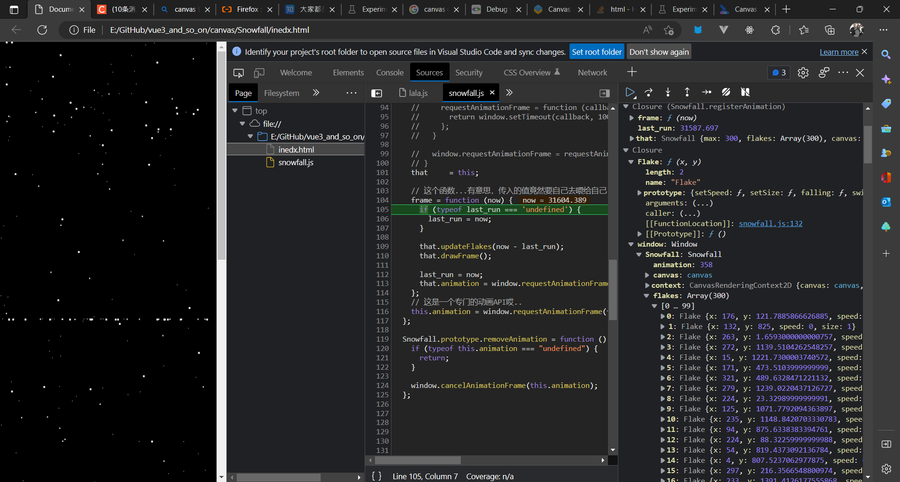
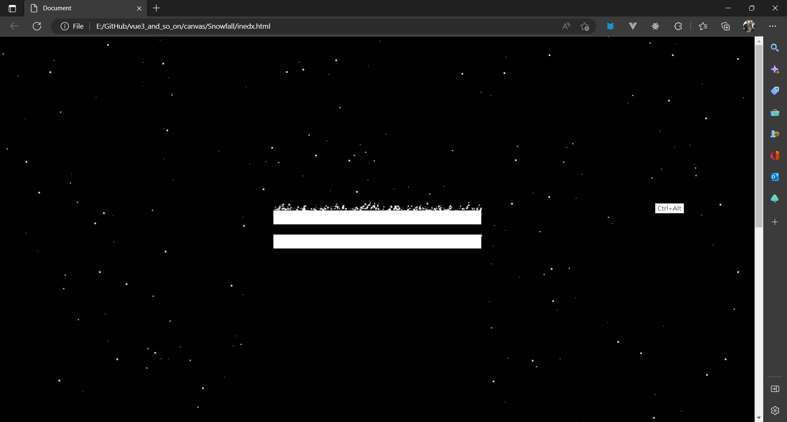

嗯...其实，也是，找到的几个仓库。然后，看代码。

找到的感觉写的最清楚的是这一个，我还跟着去看了点原型相关的东西。
**[Gargron/Snowfall](https://github.com/Gargron/Snowfall)**

另外提一下...这个作者竟然也是 mastodon 的主要开发者...好厉害...世界好小...

### 调试工具

但是...感觉能看懂，但是我尝试删改东西的时候就是不起效果，也不知道哪出的问题...
去找了半天canvas debugger工具，然后，发现tmd有一堆搬的十年前的文章...原文是这个[https://web.dev/canvas-inspection/]

[https://stackoverflow.com/questions/9143209/html5-canvas-inspector]
也看到有一些近几年的提问...就这个，但我按照这个找不到canvas的选项...

然后放弃了...

但，如果canvas做的就只是像素操作，那debug可能也看不到什么东西。说是偏底层的操作省性能...但就算提供了简单的接口让用但调试也是问题啊...其实我也看到一个直接用html的div做这个特效的，几年前的一个仓库到现在我用现在的机器去调式都卡卡的...

再者，其实只要看数据就可以了，有像针对html dom那样快速查看元素的当然好...但没有的话，能找到地方看数据也可以。再一个...对于这种超频繁刷新的玩意...别用console log，console log在大量调用的时候也很耗费性能，没几秒就上万次调用直接把我电脑整的卡的不得了......所以...这边有专门的工具，可以暂停，能看变量值和函数栈之类的东西。



### 动画

我以为主要精力会放在canvas画图上...但没想到在动画上画的功夫更多...
说起动画，就是，快速变化的相互差异较小或者说连续一张张图像，造成错觉。
两个点，一个是变化的图像或者说状态，一个是把它们连在一起。
然而，怎么连在一起？那就是————回调函数。

html5 给了一个专门的用于动画的API，用于接收一个个关键帧并调用回调函数。然而如果不用这个的话，虽然听起来有点奇怪甚至离谱...但setTimeout也能用来做动画......

[https://developer.mozilla.org/zh-CN/docs/Web/API/Window/requestAnimationFrame]

对于上面那个仓库，具体代码如下，now - last_run算出时间差，这个就是一个时间轴一样的东西...被updateFlakes()用于计算下一帧图像

```js
    frame = function (now) {
      if (typeof last_run === 'undefined') {
        last_run = now;
      }

      that.updateFlakes(now - last_run);
      that.drawFrame();

      last_run = now;
      that.animation = window.requestAnimationFrame(frame);
    };
    // 这是一个专门的动画API哎..
    this.animation = window.requestAnimationFrame(frame);
```

也许会有更复杂的函数来模拟各种运动，但是对于这个小脚本而言，简单的时间乘速度就可以了。

### 小脚本好漂亮

这个小脚本...虽然只有一百多行...但写的好漂亮...

将飘雪这个小特效分成了两个方面， Snowfall 和 Flake/Flakes。

Snowfall 是类似背景，舞台的一个对象，而 Flake/Flakes 则是具体的会飘下来的一个个小雪花。 Snowfall 提供了 canvas 画布，加了个eventListener ，然后就开始调用 Flake/Flakes 身上的属性和方法(主要是拿到位置和速度(速度这个也可以说是运动、改变位置的方式))获得一帧帧画面自己再去找回调函数把这些画面连起来。

这个抽象范式感觉可以有好多用法..比如做重力，会相互吸引的小东西的场景，碰撞......

#### 我想加东西但是不起作用呜呜呜

想加的主要有两个，一个是左右摇摆的一个随机运动还有风向，还有一个就是和html的dom元素交互，比如在特定的小dom上落雪这样...

前一个我以为在学着作者在 Flake 上加个方法，像

```js
Flake.prototype.swing = function (delta) {
    this.x += delta * this.speed; 
}
```

这样就可以...但是tmd就是不起作用或者特别鬼畜！
...
至于和其他dom元素交互，我想到的办法是，获取 html 中 dom 的left top height width 也就是位置和大小，然后用这些数据在 canvas 图层去绘制相应的图形，也不是显式的绘制，但是得标记一下，然后让雪花和 canvas 图层里标记出来的这个东西交互。但是...还有很多问题，比如雪花积累太多怎么办，要不要再给每个雪花加个 token 用来管理时间过长...这个应该也没那么难搞，像上面 now - created_token < lifeTime 就行，再一个就是，雪花和雪花之间要不要做碰撞堆叠的交互？

md想想就难搞，不会啊啊啊啊啊。看了这么多啥都没弄出来...
感觉我就像是在商场瞎逛但是其实一分钱没有就只能看看这种的...太菜了啊啊啊啊啊..不过我根本不会去逛商场..可能看看也总比不动弹强吧..

#### update 2023-01-03


嗯，感觉，要弄好了！

>昨天修改不起作用的原因也破案了，我tmd把一个该写变量 i 的地方写了个数字 1 ....................

积雪的效果就是将一部分 DOM 在 canvas 里画一遍，我把这 画在canvas 里的 DOM 叫做 Sill。然后是 flake 和初始的几个 Sill 碰撞检测，重要的地方来了，碰撞检测到了之后，flake 会被 reset，再次从顶部开始飘落，并且同时在碰撞的点上留下自己的 rect 信息，用这些信息创建一个sill。可以这么看， flake 每一次碰撞都会在碰撞地点留下一个“尸体”，这个尸体就是Sill。

这个依旧有着比较严重的性能问题...因为 flake 在碰撞检测 landed 之后会变成 sill，sill 是可以积累的，而且是随着时间积累，虽然这只是只一个 n^2 的增长，但是是随着时间增长并且没有上限的！ sills 和 flake 在之后的碰撞检测次数在积累一段时间后会很可怕...
所以把 sill 给了个 max = 500.

等我再改的漂亮些，处理些兼容问题就丢到博客上。...艹，拿不对元素的位置可真是个问题...傻逼css！

对了...我说的漂亮不是效果的漂亮..是背后的代码组织的漂亮...

### 插入博客

哇...竟然可以直接用标签插入脚本的吗，好方便..嘿嘿...为了方便看效果，我把这个页面的亮色模式也改成暗色了。

[https://v2.vuepress.vuejs.org/zh/advanced/cookbook/markdown-and-vue-sfc.html]

...好吧，打包报错。"window is not defined"，"document is not defined"，脚本这里不能用的话...日...那为什么开发模式就能用...md。只能写插件试试了。\
使用不支持 SSR 的功能
VuePress 会在构建过程中生成一个 SSR 应用，用以对页面进行预渲染。一般而言，如果一段代码在客户端应用 Mount 之前就使用了浏览器或 DOM API ，我们就认为其对 SSR 不友好，即不支持 SSR 。

其实我在想...如果打包可以忽略报错就好了...反正是能用的，但，vuepress可能并不知道具体的错误类型，不知道哪些错严重哪些不严重。所以...只能绕着它走了。

自定义插件..

[https://vuepress.vuejs.org/zh/guide/using-vue.html]

...

[https://v2.vuepress.vuejs.org/zh/reference/components.html]

艹！
只能这样跟着它走了。

最后贴一下添加了摞高高的的效果链接。

[huamurui/Snowfall](https://huamurui.github.io/Snowfall/)

<ClientOnly>
  <Snowfall />
</ClientOnly>
