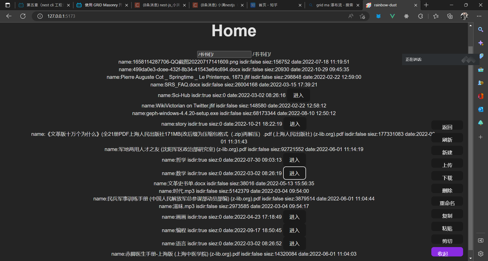

这一部分，主要想看几个开源的云盘项目的代码，如果可以的话，找个看顺眼的把它的前端用最新的技术栈重写一遍。\
依旧是一个...[go to moon](../../helloworld/why-the-moon.md)的坑，也许没有实际价值，但，...总是要走吧，至少比学校的那些憨批项目要强。

这种正规点项目的前端代码量基本是要上万了，尤其上面那个竟然20万行？虽然很大一部分是写自己写UI组件和各种调配接口...逻辑的部分也许不多，但...还是有点怕。
等看了再说吧。

### 2022-12-13

#### 现有项目考察 && 初步计划

[cloud-reve](https://github.com/cloudreve)

- gin + react

[file-browser](https://github.com/filebrowser)

- gin + vue

[alist](https://github.com/alist-org)

- gin + solid

[zfile](https://github.com/zfile)

- spring + vue

先说使用体验，如果是个人使用alist可能是用的最舒服的一个了，因为前端做的优化很多，部署也是一个命令解决。相比其他的一个亮点是，菜单栏做成了悬浮的小图标放在了右下侧，点击后出现弹窗进行相关操作，以此来代替传统的XXX管理系统的时常会显得臃肿的左侧菜单栏。\
如果是需要支持多用户，就是cloud-reve了，也很好，只不过复杂度...我想更先多关注些别的。\
file-browser没怎么用，看着给的示例也还挺好看的。

而zfile...怎么说呢，功能可能是最多的一个，但...缺少造轮子精神吧......前端的组件直接引了element ui 里的，这可能也不算问题，但好多地方看着也是真的缺少打磨。\
而除去使用，在代码组织上，zfile也是...挺让我感觉一言难尽的，前端里建了一大堆的文件和文件夹，有好多只有零星几行，而我看了半天也看不到主页面是哪个文件，结果...直接让我找到一个八百行的单文件组件...在下面。

```path
zfile-vue\src\layouts\file.vue
zfilevue\src\components\file\preview\FileGallery.vue
```

而后端部分...alist和zfile的一个对比，我想找一个对接本地储存源的东西，而...yysy，java的文件夹是真的可怕...。我也不确定这是不是java的原因，毕竟这里添的功能比较多...但一堆controller model一层层的来回套是真的......和用go写的alist相比，下面的路径长度差了都有三倍了。。。

也许java也有很多写的很好的项目..但肯定不是这一个。我想要掌握的...可能也不是语言。

```path
alist\drivers\local\driver.go

zfile\src\main\java\im\zhaojun\zfile\module\storage\model\param\LocalParam.java
```

而，下一步计划的话...我是打算先研究alist的代码了，虽然go语言和这个solid框架我都不熟悉。

- 怎么接的储存源
  - 本来就是个人使用...本地储存就够了，不用接阿里云谷歌云之类的...这些删掉可以吗。
  - 我使用本地储存的时候感觉就只是起了一个http类似的服务，然后加一个简单的地址映射...一定要后端吗，js有可能直接接吗
- 后端都干了什么？
  - 这个是我不熟悉不确定的...以至于我觉得把这里挪走也可以，所以要看...
- 文件在线查看的功能添加
  - 抄！
  - 再一个是图片查看弄成个更好看点的画廊
- 页面设计
  - 抄...我好狠狠的抄...
- 部署，怎么做到一个命令就完成部署的

这样看好烦哦...尤其后端，太不熟了，有没有数据库表设计，接口文档...或者最小实现之类的。

如果能够有像画画那样...从架子开始，到填补小元素的...

要不...起个名字把架子搭起来先？
或者你也要考虑这个项目的核心是什么，什么登录权限，增删改查一类的业务都先一边去，数据有一个基本的浏览与展示就是我需要的，然后就是写前端UI。

#### go项目的考察

go项目结构的瞎bb，如果和上面那个java对比的话，扁平化做的很明显，虽然经常一大列，但好在没有太深的文件夹。（大部分可能本来就不需要

main.go是入口。与之相关的还有cmd这个文件夹，里面有一串启动脚本。\
go.mod和go.sum与项目依赖有关，具体些对应前端，mod像是package json，sum像是lock file。而依赖的具体文件...md又往C盘塞对吧。

pkg似乎是个工具包\
public是静态文件，前后端合并部署的话要把前端塞这里。\
server就是服务，像java的tomcat一样，但在前后端分离的开发中这个服务大概是专门提供接口的，而接口...也可以用路由集成一下。

drivers是对接各个储存源，也许是这个项目特有...或者像java那边的resources，数据源还有各种各样的东西...\
internal就是...服务的核心了吧...毕竟就剩它了。但我看不动...麻麻的。

两个关键部分。

```path
sqlite alist\alist\data\data.db
router alist\alist\server\router.go
```

前端请求

```path
axios alist-web\src\utils\api.ts
```

#### solid

嗯...大部分都没什么，直接说发现的东西好了。就是，文件名大小写，如果是常规的，每个项目都有的那些router、store、index之类的，就是全小写，而这个项目里特有的，需要查看的，或者说特有的特色部分...自己写的那些文件，就是大写首字母。\
这个项目UI和功能部分的的亮点几乎都在home这个page里，而这个文件夹下的内容也是很多很多...有自己的components和一大串子组件，都写在这里了。而另一个后台页面也挺大，但...比较常规。\
而，直接在src目录下的components和hooks，却没那么多东西，基本都是些背景、零碎的东西。axios甚至被塞到了utils这个文件夹里...可见根本不是重点.jpg\
可能写的都很有特色...吧...但蛮清楚的。或者单纯我见得太少了。

### 2022-12-14

#### 要动手了...

在这里，后端主要是和操作系统和数据库交互，如果是狭义的前端，前端代码是运行在用户的浏览器活客户端里的，不能直接碰到服务端资源...\
用java或者go再或者nodejs的一些服务端框架，哪个都无所谓，都能用，尤其如果只是做个小玩具那就更随便了...能通就行。\
所以...打算用go试一试，做出基本的、简陋的功能出来，然后前端用vue接一下。害...我有预感这一步更多的可能只是熟悉工具，基本做不出成品的，放心做吧。

数据抽象，UI，组合成功能...啊...还是没头绪，做完demo还得再看。

### 2022-12-16

嗯，用gin捏出了些小东西，另外，对alist的理解...就是说......前端的好多组件、布局什么的它也是用的封装好的库...关于名字，虽然大小写我大概能猜出来是什么，但中划线和下划线有区别吗？还是单纯...就是玩。

再另外我找到了个浏览器内置的的文件查看的脚本...但只看到了前端部分，跳转时的数据查询什么的...看不到...

再再另外大概差不多确认好了第一个功能做什么。

那就是，完成最最基本的功能。具体包括：

- 上传
  - 单文件/多文件/空目录
  - 拖拽(可以整花活，可以直接导包)

- 查看
  - 一个路径/目录/文件夹内的文件、文件属性查询
  - 目录跳转
  - 下载(这里能搞得..也不少，更多的是传输优化，像BT，aria2之类...上传是不是也能这样？)
  - 预览preview(这里能做的太多了，包括在线的删除修改。花活居多，并不是基本功能，就提一下)

以上是以功能角度来看的，实现上...我从alist的代码里可看到了些东西，比如将文件和文件夹看做对象，对的，对于云盘这个项目而言，这大概是最重要的一个对象。而，为什么要区分文件和文件夹...我好久之前有觉得那些编程语言或命令提供的idDir这个东西鸡肋，大概是因为天天看图形界面看爽了，真要在纯代码或命令里去完成那些功能...不这样分，不提供isDir这个接口，我也想不出来别的好办法。\
另外，...前端的设计、布局，还有前后端的工程化...这些也属于基本需求，也都是问题啊...再另外vite最近变4.0.0默认版本了

```path
alist\server\handles\fsread.go--func toObjsResp
```

之后的第一步大概还是美化前端，再然后是有关preview甚至webDav，再再然后是添那些用户登录权限控制之类的功能。\
不过还早...先做吧。

不对...我又好好查了查，webDav，这个东西和文件的共享，在线编辑，git好像都有点相像有点关系的样子...是一个通过网络请求修改文件的东西......\
alist的核心好像就是去接通这个webDav...
md...
不过也不坏，有的玩了。

### 2022-12-21

期末考试加上感染新冠...好久没动弹...

花了点功夫把基本的文件展示和跳转做出来了（前后端我写的代码加起来都不一定够一百行），上传也挺简单...但还是想先放弃go。
改用nest+vue。毕竟现在没什么特别需求，而go那一套我也是...太不熟悉...而且听说nest就是个小spring。

这些框架...也都没什么神奇的，它们诞生是为了处理业务，做的漂亮些好用好玩些...当然是好的。只是...好无聊...日...
除了SPA那一堆堆的SSG SSR吵来吵去也没个定型。但都不是我要关心的事.jpg。

先谈需求。
对。
技术熟不熟悉都可以朝后靠靠，而且上面试了这一通，应该差不多是可以做到的。
把网页的样式和功能确定一下先。

啊...中午了。
再探再报。

重新确认一下功能方面，主要从前端开始。

- 文件与文件夹(目录)的基本图形化操作
  - 查看
    - 文件夹目录的查看
  - 跳转
    - 也是目录相关，或者我应该把目录或路径当作主要...而不是这一系列行为。？
  - 下载
    - 只针对文件
  - 上传
    - 单文件多文件文件夹
  - 快捷操作
    - 复选
  - ps:展示的路径与操作系统路径映射与记录，这一条与上面都有相关......

- UI/UX
  - 前台页面上悬浮，可隐藏的菜单,弹窗进行具体操作
  - 主题切换 & 自定义
  - 文件列表的行列两种展示
  - 预览文件 & where it shines
    - 多个 ps:多个文件展示与文件列表展示也有关系
      - 图片画廊
        - 瀑布流，全屏，轮播，幻灯片......
    - 单个
      - 文本编辑
      - html渲染
        - 这俩合一块弄个简单的在线开发也不是不可..吧 ~
      - 音频视频播放

- 通用
  - 后台管理页面
    - 登录
    - 权限
    - 基本设置

然后就到了数据方面...
其实我在好奇，感觉基本功能是需要的就只是一个路径...用于查看和上传下载。因为..好像压根没有什么特别要处理的，要做的主要是对接操作系统，接完了就全交给操作系统处理就好了...。
或者是现在没必要...那如果有了那就之后再说。

### 2022-12-22

还是不想动...要做的还有...好多...

换种方式，用，以对象为中心去思考...今天还是主要做前端

- 路径
  - 路径...或者说文件夹、目录要说也可以看做一种特殊的文件，它像是种文件的文件，虽然它们本身空空如也，但如果把文件看做文件的名子，那这个已是文件的文件名也只是个壳子而已，再往里挖挖到namespace，挖到变量名与实际数据，挖到数据和背后的内存地址...那就没意思了。文件夹记录或者说确认了文件位置，而位置很多时候也意味着相互关系。
    - ps:这甚至又让我想到了html，md，那些```小<div>```就像是这种分块，描述着内容间的关系与结构。
    - ps2:这部分可以是哲学上能指与所指的二分，也可以是C语言里的指针那一堆东西..。我会说真正的实在的东西，也就是所指，其实是不存在的，能操作的，能够被人所把握的，进入了人类世界的，都是能指。
  - 文件的查看上传修改等等都要依赖路径。
  - 而在具体实现上
    - 因为文件的一系列操作要依赖这里...肯定要维护一个公共变量。可能是个不断来回pop push的数组。
    - 路径的常见的一个显式表达可能就是“面包屑导航栏”，在web前端这边可以结合路由来实现。
    - 其实也有想过像我正在用的vscode旁边这种直接树状展示可折叠的侧边栏...不需要来回变动直接一览无余之类的...但感觉不是首要目标先不管这个。
- 文件
  - 查看
    - 各种预览...像上面一样
  - 运行
    - 或许我应该说，需要特殊软件处理才能查看的文件...
  - 增删改
    - 常规操作
    - 我没有把“查”写在这里...一个是上面的“查看”写了一部分，一个是路径也与查有关...而这里的查主要应该是“搜索”。而搜索依旧主要根据文本数据，音频图片等等也是需要命名打标签才能被查找...我知道现在有好多听歌识曲，拍照识物的...但...可能人最容易把握的还是符号吧...嗯，其实我觉得做得好的图形化也是另一种符号。

...感觉也是没得写了，别贫了去写代码去。

### 2022-12-23

很...不知道怎么说。
晚上才开始认真写点东西。
我又在怀疑我做这些的意义...但比现在这些没有意义的事...多的是呢...就像我那花了八百买个在github上就能找到的代码的同学，我tmd在开课三四天的时候就找把链接到发群里了结果没人管，现在花了钱就开始上心了...tmd也就光买了代码，运行调试都懒得做...

我是完全不想管那堆事了...我是不知道什么是应该做的事，什么是有用的事...可，绝不是现在这样。

更具体一些的

- 前端
  - 布局
    - 页面美化
    - 响应式
  - 弹窗组件封装
    - 拖拽上传
  - http请求
    - 这方面其实也对应着新的需求，而目前这两个接口肯定不够用，我突然想到除了基本的查看，下载。更复杂的操作像是————剪切，复制粘贴，直接在页面上拖拽实现改变文件位置...这都...好棒...也太烦人了。

- 后端
  - 要考虑加上登录，权限部分了...
    - 看到个叫jwt的...
    - 这部分到底要不要加数据库...感觉完全没必要...

哈...不会写啊...

### 2022-12-24

基本功能写出来了...可...这代码好少哦...
查看和上传，前后端加起来也就一二百行吧...

也许大量的代码都要花在美化、安全、边界处理..还有各种各样的琐事上...

最简单的，我现在是把功能全都写到一个组件里了，那这些功能所共同依赖的一个数据————“当前路径”就可以很方便的访问修改...但如果要写更多东西，就必须要拆组件了不然太难翻，然后组件间消息同步就也需要了...

嗯...继续写，学着去，考虑更多些，学着...添东西，组织代码。

后端现在就仨接口，一个/paths 一个/upload 一个/download
都接受一个参数dst用来确认路径

前端就一个home页。

可以开始学东西了...就是，基础的，烂大街的那一套。

---

java那边还是一堆一堆的问题啊..
为什么我不早点开始写这个项目...
早些把它写成规模...

什么都好...

算了。

- 前端
  - win系统的单击是选中而不是打开...
  - 而手机上的长按与这里的单击相似。
  - 再或者右键，或者再次腾出一个按钮用来切成“管理模式”....
  - 它们想要实现的功能都是类似的......

文件夹的两种可视化切换问题...这个可以看做一种preview，也可以看做setting主题...
单独摘出来也是一个...

又调通了几个接口...
可这又有什么用呢...
我还是没有掌控大量代码的能力...哪怕只是业务代码。

java 那边的 hadoop 环境还是...让人头疼。

我知道也许这个时候没多少人会.....但我...
而且没时间了。一天能做什么？在你对这些几乎都一无所知的时候？

用能用的接口，把前端写好。即使只有一个文件上传接口，也可以把循环放到前端。

把虚拟路径做了，即文件夹根目录的替换映射。数据就写死到manage组件内也好...或者store...
home组件的根目录写成变量，从别的地方传进去。
这部分本应该存到数据库的...

### 2022-12-25

::: details 碎碎念
昨晚失眠了...
就像7月份那次一样...
算算我在23号能起来写东西，也就两三天而已..干什么都不够的。
整个项目给的时间也就10天左右，除去考试生病答辩准备这些，可能也就五六天写代码的时间。
根本不够...再或我应该开始的更早才对。

睡不好，没食欲，后背也凉凉的不舒服。
我也不可能在这种状态下好好生活或工作...
我好像总是走到了最糟糕的地方...虽然好多我也没得选。

我又多久没做别的了？
锻炼身体也好...画画捏泥巴做点吃的也好...
我都想要......
所以先停下吧，糊完学校作业先停停。
糊不好也没关系...

再提一点点，我曾看过公务员说基层工作总是被“表单和摊派”这种暴力的方式执行，也会现实世界中造成一大片的不合理，但计算机好像就是这么工作的，计算机里的那群器件就喜欢这样的。
而良好的软件架构，也就是良好的“表单与摊派”，能让写代码像翻译文字一样简单...我记得在看java的面向对象的一些例子的时候，尤其举的那种动物是人的类种，人是动物的特化、具体化...这样的例子简直太轻松了...各个结构关系都那么清晰
也许，做软件或者具体点，业务更多的不是和计算机bb，而是对业务的整理、划分。

2022年12月25日07:05:03

花了点时间帮一个同学调通了...写报告应该没啥问题了。
只能说还好还有一个能调通的
我知道我做的很糟...我也知道这个地方很糟...
我不知道别处是什么样子...但...和我自己预想的差的太多了。

老师给的这个项目原版...有点烂...也很旧。
hadoop也有些画蛇添足...

那你...去考虑一个，合适的解法。
时间紧、业务和技术不熟悉，都无所谓。
之后可有的是时间了。
做出来些东西...
:::

- 路径
  - 这个功能是之后很多东西的依赖...从查看到上传下载这些功能都需要...
  - 而这些功能与后端交互，走axios也是必须的...
  - 总之拼接路径没那么简单...要把这部分拆出来，拆出来也方便做很多别的骚操作，这样的话...其余组件功能也要拆了了。
  - 如果 nickpath 和 realpath 的映射存到后台那边或者放数据库里，那...是不是要在主页的时候发一次请求来请求这部分...

或者也没必要这么急...
再看看alist的代码...

其实啊..我在看顶部那些面包屑导航，侧边栏树状路径图的时候...又想到这些东西可能什么地方都能用。
我用的这个博客就是这样定位文章的。一个个md文件的结构放左边，而对于markdown内部的结构，是被放在了右边。
大部分app的这部分是写死的...但通过一种有一定秩序，但又不完全写死堵死的方式去做点东西...嗯，我喜欢这种制造错落的秩序的感觉。

只不过...之前瀑布流我白忙活好大一阵，这个导航栏...也许我也应该多看看。然后再写。

### 2022-12-26

告一段落

### 2022-12-30

...就是说...处理字符串可真是...一门学问。

我做导航栏跳转，做爬虫发请求要用，操作系统里通过路径找文件要用，平铺的路径转树状结构要用，vite，nginx配置转发要用...
......我以为会有很神奇的处理方式去做这些，但想了想，想要去实现这堆玩意的时候我脑子里第一个想到的竟然都tmd是处理字符串。
我知道字符串这个概念已经是高级语言里才有的，但高级语言的编译是不是也能看成字符串的映射？

还有一堆...最长回文串，子序列之类的算法题...虽然现在还看不懂它们能有什么用，但折腾人是有一套的。...好吧前端框架的diff算法就与最长子序列这个问题有关...他们真的不是神经病才搞出这堆算法的。...但我大概这辈子都不会写这样的代码......

还有一件事，关于云盘这个项目，我在怀疑一件事，我会不会到最后给它弄成...像是宝塔面板和git的混合物一样的东西......Linux使用指南？个人的Linux服务器都能干什么？
命令行是不用我去实现了，而除了图形化的文件文本操作，图像查看音频播放，还有各种一件安装脚本的集合...

### 2022-12-31

啊...还是不想动
感觉...就，这样，用spring和vue去写吧。
感觉上传下载都好说...页面美化一下，前端拆一拆，封装一下请求。做点权限认证和保护。然后再去找各种插件去做查看和播放功能。对了...多线程进程又是在干什么？socket？IO和这些...有机会去看看。

vue的模板语法...v-for中通过index来获取数组索引...感觉...tmd...就不如直接js，jsx去创建dom了啊...md...包括之前vue2 props里的数据验证...不如直接上ts...为什么非要被vue截胡，日了。不管了。能跑就行。

啊

### 2023-01-06

[demos_of_file_operation](https://github.com/huamurui/all_kinds_of_hello_world_and_so_on_and_so_on/tree/master/demos_of_file_operation)

要搁置了...
所以就把做的一个demo链接贴一下。哈...前后也就两三百行的代码...对了，下载的那个函数你大概是得用 axios 重写一下，不然写死的链接一直朝 localhost 去发请求算怎么回事...\
想添的可以添...有好多好多对吗？就像你上面想的，它可以长成各种形状。
只是我都不会罢了，叹气.jpg
