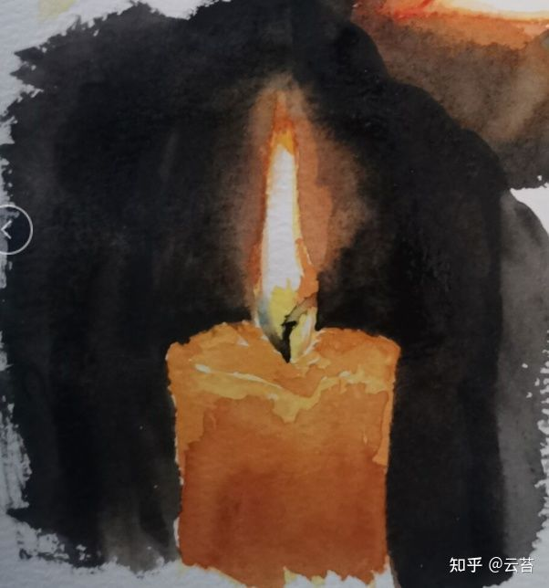

### 20码麻布=1件上衣

>交换价值、商品价值的神奇之处就是，它们只在交换中，在与同自己相异的东西交换中，才能显现出来————说20码麻布=20码麻布毫无意义，但在说20码麻布=1件上衣时，似乎有一种神奇的，出离于麻布、上衣本身的东西出现了，让原本根本不能画上等号的东西强行相等了起来。交换价值并非原本就存在的玩意，它需要靠交换这一行为、运动才能显现出来。

>只有在他者眼中，才能看见自己的存在与意义。只有原本的伯牙和千里马还不够，还要有钟子期和伯乐，那些价值才能被映现出来，像镜子一样。推广一下，人的本质并不存在，存在的是社会关系，是关系的运动产生了各异的人，“人的本质是社会关系的总和”像是另一种“王侯将相宁有种乎”，国王资本家并非本身有什么神秘才智，无产者也并非就是流氓，这些位置的产生并不是有意识、有依据进行的，那是股他们看不见的、出离于他们的东西运动的结果。

### 画画

>素描里有一个很吊诡的步骤叫“压暗面”，只有把该黑的变成黑的，亮的才能在人眼中显出亮色来......这不只是一个简单的、相互的、对等的对比关系，操作过程中画者能给白纸增添的只有比白更深的颜色，一张白纸本身并不会让人觉得明亮，反而是在上面填了大片的黑色之后，余下的那片空白才会亮起来，甚至显得刺眼。
>>ps：绘画里面用到这种“对比”的样式太多了，黑与白，明与暗，虚与实，小与大，远与近，平与斜，直与曲，还有各种色彩......这让我想到了弗洛伊德发现自己的小外孙一两岁时，当母亲不在身边，会把线圈扔出去再抓回来玩，扔出去时喊“Fort”（德语的“去”），抓回来时喊“Da”（德语的“来”）。以及...doi时的循环运动，只放进去或者不放进去都不会快乐，快乐在运动中才会出现。

### 事物与联系。

经典的笨蛋理解就是先有事物后有联系，事物是实在而联系只是事物上面的方法属性；但，从上面的论述引导中，可以看到一个相反的历史，真正运动着的、真正具有物质性的东西，恰恰就是联系，甚至可以更进一步，是联系本身创造了其联系的事物。我明白这样讲像是在说孩子把妈生出来，但仔细去看，母亲是靠着生出孩子才成为了母亲；英雄是靠着英勇的行为才成为了英雄；罪犯是因其恶行而成为了罪犯。

>如果把关系看做固定的，那正在运动着的其实是人——想想在恋爱时一遍遍被不同的人说出的“我爱你”，这句话是不变的，甚至这句话背后的爱情也是不变的，只是它们在不同的人身上一次次实现着自己。

---

可是...这与镜子有什么关系？
